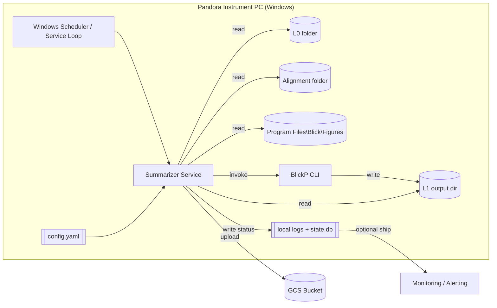
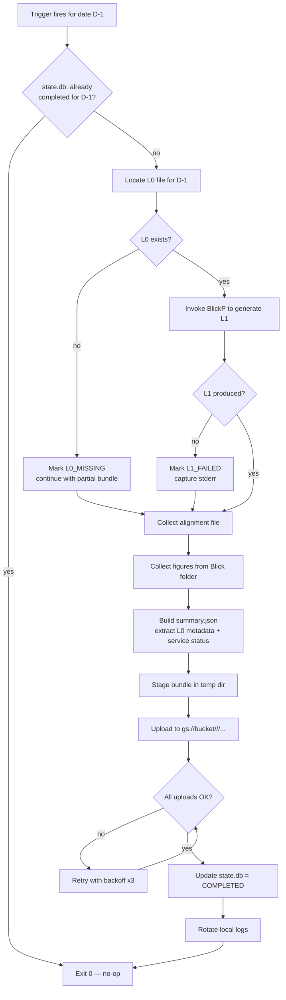
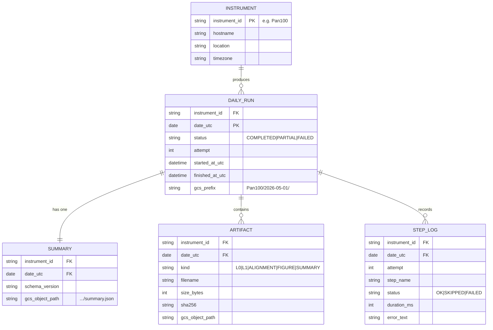

# Pandora Summarizer — Design Document

**Version:** 0.1 (draft)
**Date:** 2026-05-08
**Owner:** PGN / Pandora Operations
**Status:** Pre-development

---

## 1. Overview

Pandora Summarizer is a lightweight background service installed on each Pandora instrument computer in the PGN (Pandonia Global Network). Once per day it gathers the previous day's data products, generates a derived L1 file and a `summary.json`, and uploads the bundle to a Google Cloud Storage (GCS) bucket organized by instrument and date.

### 1.1 Goals

- Reliably push yesterday's L0, L1, alignment, figures, and summary to GCS for every Pandora in the network.
- Reproducible folder layout on GCS so downstream consumers can find data deterministically.
- Self-reporting health: every daily run records its status in `summary.json` even on partial failure.
- Minimal footprint on the instrument PC; no interference with BlickP acquisition.

### 1.2 Non-goals

- Real-time / sub-daily streaming of data.
- Re-processing or scientific reanalysis of L1 (we only run BlickP's existing routines).
- A central control plane (initial version uses local config + GCS only).
- Backfilling years of historical data on first run (separate one-shot tool).

### 1.3 Assumptions

- Target OS is Windows (BlickP runs on Windows; figures live under `Program Files\Blick`).
- BlickP exposes a callable CLI / scriptable entrypoint that produces L1 from a given L0 file. **Open question — confirm exact invocation.**
- Each instrument PC has outbound HTTPS to `storage.googleapis.com`.
- Instrument ID (e.g., `Pan100`, `Pan175`) is known per host and stable.
- L0 files land in a known folder daily, named with a parseable date.

---

## 2. Scope of Data per Daily Run

For day `D-1` (yesterday, in instrument-local timezone — **confirm: local or UTC**), the service collects:

| # | Artifact | Source | Produced by |
|---|----------|--------|-------------|
| 1 | L0 file | designated L0 folder on disk | Pandora acquisition (existing) |
| 2 | L1 file | derived from L0 via BlickP | Summarizer (calls BlickP) |
| 3 | Figures / diagrams | `C:\Program Files\Blick\...` (figures subfolder) | BlickP (existing) |
| 4 | Alignment file | designated alignment folder | Pandora calibration (existing) |
| 5 | `summary.json` | generated in-memory | Summarizer |

`summary.json` contains both extracted L0 highlights (counts, time range, basic QC) and a service-status block (steps run, durations, errors).

---

## 3. GCS Layout

```
gs://<bucket>/
├── Pan100/
│   ├── 2026-05-01/
│   │   ├── data/
│   │   │   ├── <L0 filename>
│   │   │   ├── <L1 filename>
│   │   │   ├── <alignment filename>
│   │   │   └── figures/
│   │   │       ├── fig_001.png
│   │   │       └── ...
│   │   └── summary.json
│   ├── 2026-05-02/
│   └── ...
├── Pan175/
│   └── ...
```

**Conventions**
- Date folder: ISO `YYYY-MM-DD` (machine-sortable; the example "May 1st 2026" in the prompt is reformatted for tooling-friendliness — confirm preference).
- `data/` holds everything except `summary.json`, which sits at the day root for easy listing.
- Per-day idempotency: re-running the same day overwrites existing objects (uploads use `If-Generation-Match: 0` only when `--no-overwrite` is set).

---

## 4. High-Level Architecture



### 4.1 Components

- **Scheduler**: Windows Task Scheduler entry, or service-internal cron-like loop. Default trigger: `02:00` local time daily.
- **Summarizer Service**: the binary/package this project ships. Stateless across runs except for `state.db` (SQLite) which records per-day completion.
- **Local State (SQLite)**: tracks `(date, instrument_id, step, status, attempt_count, last_error)` so retries are deterministic.
- **GCS Client**: official Google Cloud Storage SDK; auth via service-account JSON pinned to the host.
- **Logging**: rotating local file (`%ProgramData%\PandoraSummarizer\logs\`) plus structured JSON lines for later shipping.

---

## 5. Daily Run Flow



### 5.1 Failure semantics

- Any step failure is recorded in `summary.json` under `service_status.steps[]` with timestamps and error text — the bundle still uploads so operators see the failure remotely.
- Final state in `state.db` is `COMPLETED`, `PARTIAL`, or `FAILED`.
- `FAILED` runs are retried by the next trigger up to `max_attempts` (default 3) before being parked for manual intervention.

---

## 6. `summary.json` Schema

```jsonc
{
  "schema_version": "1.0",
  "instrument_id": "Pan100",
  "date_utc": "2026-05-01",
  "generated_at_utc": "2026-05-02T02:04:11Z",
  "host": {
    "hostname": "PAN100-PC",
    "os": "Windows 10 Pro 22H2",
    "summarizer_version": "0.1.0",
    "blickp_version": "x.y.z"
  },
  "l0": {
    "filename": "Pandora100s1_BoulderCO_20260501.txt",
    "size_bytes": 12345678,
    "sha256": "…",
    "record_count": 14400,
    "first_timestamp_utc": "2026-05-01T00:00:02Z",
    "last_timestamp_utc":  "2026-05-01T23:59:58Z",
    "qc": {
      "missing_minutes": 3,
      "saturated_records": 0,
      "dark_count_mean": 1024.7
    }
  },
  "l1": {
    "filename": "…",
    "size_bytes": 0,
    "generated": true
  },
  "alignment": { "filename": "…", "size_bytes": 0 },
  "figures": { "count": 12, "total_bytes": 0 },
  "service_status": {
    "overall": "COMPLETED",          // COMPLETED | PARTIAL | FAILED
    "attempt": 1,
    "duration_seconds": 142,
    "steps": [
      { "name": "locate_l0",   "status": "OK",     "duration_ms": 12 },
      { "name": "generate_l1", "status": "OK",     "duration_ms": 91000 },
      { "name": "collect_alignment", "status": "OK", "duration_ms": 8 },
      { "name": "collect_figures",   "status": "OK", "duration_ms": 220 },
      { "name": "upload_gcs",  "status": "OK",     "duration_ms": 50100,
        "objects_uploaded": 17, "bytes_uploaded": 23456789 }
    ],
    "errors": []
  }
}
```

The exact L0 QC fields are placeholders — finalize once L0 parser is implemented.

---

## 7. Data Model (ER Diagram)

The service is mostly file-driven; the only persistent store is the local SQLite `state.db`. The diagram below also shows the conceptual GCS object model so the relationships are clear end-to-end.



`state.db` mirrors `DAILY_RUN`, `ARTIFACT`, and `STEP_LOG` locally. `INSTRUMENT` is effectively a single row per host (loaded from `config.yaml`).

---

## 8. Configuration

`config.yaml` lives at `%ProgramData%\PandoraSummarizer\config.yaml`.

```yaml
instrument:
  id: Pan100
  timezone: America/Denver

paths:
  l0_dir: D:\Pandora\L0
  l1_out_dir: D:\Pandora\L1
  alignment_dir: D:\Pandora\Alignment
  blick_figures_dir: C:\Program Files\Blick\Figures
  blickp_exe: C:\Program Files\Blick\BlickP.exe

schedule:
  run_time_local: "02:00"
  process_lookback_days: 1     # always D-1; >1 enables short backfill

gcs:
  bucket: pgn-pandora-daily
  service_account_json: C:\ProgramData\PandoraSummarizer\sa.json
  overwrite_existing: true

retry:
  max_attempts: 3
  backoff_seconds: [30, 120, 600]

logging:
  dir: C:\ProgramData\PandoraSummarizer\logs
  level: INFO
  rotate_mb: 25
  keep_files: 14
```

---

## 9. Repository / Service Structure

Recommended language: **Python 3.11+** (fast to ship, mature GCS SDK, easy Windows packaging via PyInstaller). Alternative: Go for a single static binary — pick one and stay consistent.

```
Pandora-Summarizer/
├── DESIGN.md                       # this document
├── README.md
├── pyproject.toml
├── requirements.txt
├── installer/
│   ├── install.ps1                 # registers Windows scheduled task / service
│   ├── uninstall.ps1
│   └── pandora-summarizer.wxs      # optional MSI definition
├── config/
│   └── config.example.yaml
├── src/pandora_summarizer/
│   ├── __init__.py
│   ├── __main__.py                 # CLI entry: `pandora-summarizer run --date 2026-05-01`
│   ├── config.py                   # load/validate config.yaml
│   ├── orchestrator.py             # daily run state machine
│   ├── steps/
│   │   ├── locate_l0.py
│   │   ├── generate_l1.py          # wraps BlickP CLI
│   │   ├── collect_alignment.py
│   │   ├── collect_figures.py
│   │   └── build_summary.py
│   ├── parsers/
│   │   └── l0_parser.py            # extracts QC fields for summary.json
│   ├── gcs/
│   │   └── uploader.py             # retry, idempotent upload, manifest
│   ├── state/
│   │   ├── db.py                   # SQLite schema + migrations
│   │   └── models.py
│   ├── logging_setup.py
│   └── version.py
├── tests/
│   ├── unit/
│   │   ├── test_l0_parser.py
│   │   ├── test_orchestrator.py
│   │   └── test_uploader.py
│   ├── integration/
│   │   └── test_end_to_end_fakes.py
│   └── fixtures/
│       └── sample_l0/
└── docs/
    ├── runbook.md                  # ops: how to retry a failed day, rotate SA key
    └── troubleshooting.md
```

### 9.1 Install footprint on the instrument PC

```
C:\Program Files\PandoraSummarizer\        (binary + dependencies)
C:\ProgramData\PandoraSummarizer\
    config.yaml
    sa.json                                (service-account key, ACL: SYSTEM only)
    state.db
    logs\
```

---

## 10. Build / Package / Deploy


- CI: GitHub Actions (Windows runner) — lint (`ruff`), type-check (`mypy`), unit tests (`pytest`), build MSI on tag.
- Versioning: SemVer; `version.py` is the single source of truth.
- Rollout: stage to one Pandora first (`Pan100`), watch GCS for 3 days, then network-wide.

---

## 11. Security

- Service account key stored under `%ProgramData%` with NTFS ACL restricted to `SYSTEM` and the local admin group.
- Service account scope limited to a single bucket with `roles/storage.objectCreator` (no list/delete on prod data).
- No inbound network listeners. Outbound HTTPS only.
- `summary.json` must not include any local filesystem paths beyond filenames (avoid leaking host layout).
- Code-signing on the installer to prevent tampered binaries.

---

## 12. Observability

- **Local**: rotating JSON logs; last 14 days retained.
- **Remote**: every `summary.json` is itself a health beacon. A separate (out-of-scope for v0.1) Cloud Function can list `summary.json` files daily and alert when:
  - any instrument has no upload for `D-1` by 06:00 UTC, or
  - `service_status.overall != "COMPLETED"`.

---

## 13. Open Questions

1. Exact BlickP invocation to produce L1 from an L0 path — confirm flags and output location.
2. Date semantics: instrument-local day vs. UTC day for "yesterday".
3. Date folder format on GCS: `2026-05-01` (proposed) vs. `May 1st 2026` (as in prompt).
4. Alignment file cadence — is it daily, or only when changed? If only-when-changed, do we still upload it every day or skip?
5. Maximum expected daily figure count and total size (sets upload SLA).
6. Is there a need to upload a manifest/checksum file alongside `summary.json`?
7. Network reliability per site — do any Pandoras sit behind metered or intermittent links? May need a queue + resume model rather than fire-and-forget retries.

---

## 14. Milestones

| # | Milestone | Output |
|---|-----------|--------|
| M1 | Skeleton + config loader + state.db | `pandora-summarizer run --dry-run` works |
| M2 | L0 parser + summary.json builder | Unit tests on real L0 fixture |
| M3 | BlickP wrapper + figure/alignment collectors | End-to-end on dev box, no upload |
| M4 | GCS uploader with retries + idempotency | Bundle uploads to dev bucket |
| M5 | Windows installer + Scheduled Task | One-click install on Pan100 |
| M6 | Pilot on Pan100 for 1 week | Green dashboard, then network rollout |
